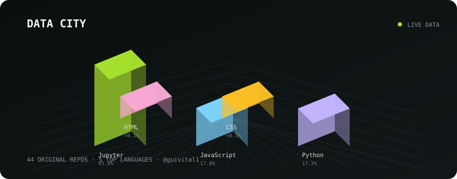

<p align="center">
  
</p>

<p align="center">
  <a href="https://www.linkedin.com/in/guilherme-vital-rodrigues/">LinkedIn</a>
  &nbsp;•&nbsp;
  <a href="https://github.com/guivital1?tab=repositories">Projects</a>
</p>

## Hello, I'm Guilherme.

Software Engineering student at **FIAP**, focused on turning operational data into useful indicators, automations, and models that support better business decisions.

Currently working with **data, analytics, and financial automation** at **MUV Capital** — from reconciliation routines and data pipelines to dashboards, predictive models, and digital catalog ROI analysis.

```text
focus     data analytics · business intelligence · financial automation
building  pipelines · dashboards · predictive models · web solutions
learning  machine learning · cloud · generative AI
beyond    gym · football · technology
```

## Toolkit

**Core:** Python · SQL · Data Analysis · Statistics · Machine Learning  
**Analytics:** Dashboards · BI · Data Visualization · Business Metrics  
**Exploring:** Cloud · Generative AI · Web Development

## My data city

<p align="center">
  
</p>

<p align="center">
  <sub>Each building is a language. Its height reflects how much I have built with it. Updated automatically every day.</sub>
</p>

## What drives me

I enjoy connecting technology and business context to build solutions that are clear, practical, and measurable. My goal is simple: make data useful.

<details>
  <summary>Em português</summary>
  <br />
  Sou estudante de Engenharia de Software na FIAP, com atuação em dados, analytics e automação financeira. Gosto de transformar dados operacionais em indicadores, automações e modelos que apoiem decisões de negócio.
</details>

---

<p align="center">
  <sub>São Paulo, Brazil · Open to opportunities in Data & Analytics</sub>
</p>
