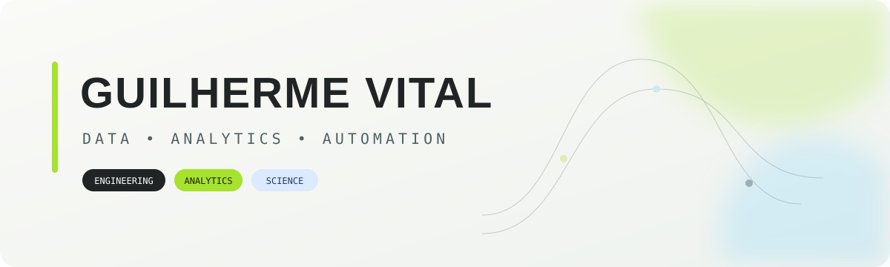
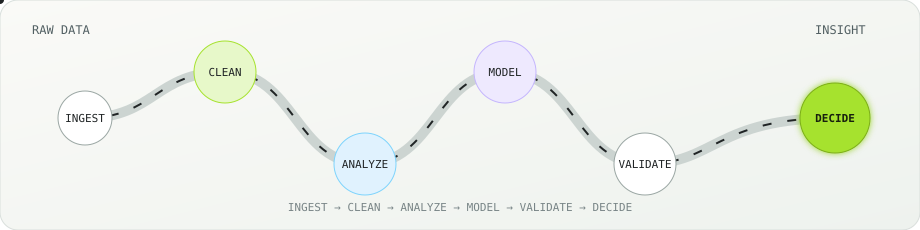

  

  
  

  Software Engineering @ FIAP &nbsp;•&nbsp; Data & Analytics @ MUV Capital

  
  
  
  
  

  

<table align="center">
  <tr>
    <td align="center">⚙️ <strong>Engineering</strong> Pipelines & automation</td>
    <td align="center">📊 <strong>Analytics</strong> Metrics & dashboards</td>
    <td align="center">🧠 <strong>Science</strong> Models & experiments</td>
  </tr>
</table>

  Python · SQL · Statistics · BI · Machine Learning · Cloud 
  São Paulo, Brazil

